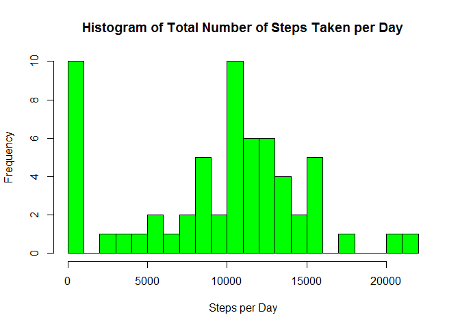
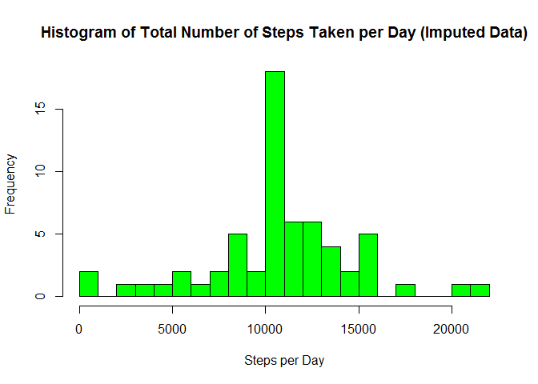
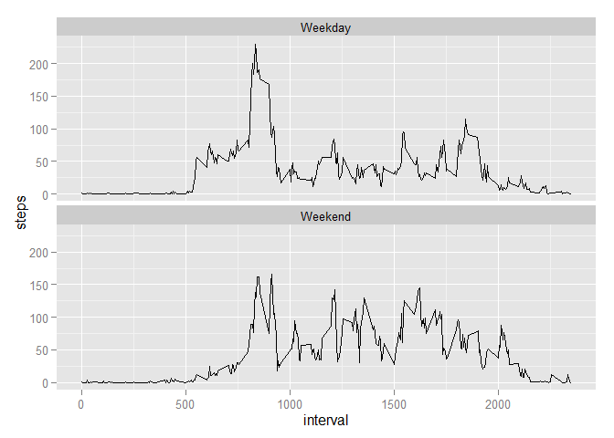

# Reproducible Research: Assignment 1

## Loading and preprocessing the data
To do the offline process, this implementation has downloaded the file to be accessed locally.

```r
ActivityData <- read.csv("activity.csv")
str(ActivityData)
```

```
## 'data.frame':	17568 obs. of  3 variables:
##  $ steps   : int  NA NA NA NA NA NA NA NA NA NA ...
##  $ date    : Factor w/ 61 levels "2012-10-01","2012-10-02",..: 1 1 1 1 1 1 1 1 1 1 ...
##  $ interval: int  0 5 10 15 20 25 30 35 40 45 ...
```

## Problem 1: What is the mean total number of steps taken per day?
The following histogram displays the total number of steps taken per day, ignoring missing values.

```r
ActivityData.date <- aggregate(ActivityData[1],by=ActivityData[2],FUN=sum, na.rm=TRUE)
hist(ActivityData.date$steps,
     breaks=20,
     col = "green",
     main = "Histogram of Total Number of Steps Taken per Day",
     xlab = "Steps per Day")
```

 

```r
mean(ActivityData.date$steps)   # mean
```

```
## [1] 9354.23
```

```r
median(ActivityData.date$steps) # median
```

```
## [1] 10395
```

**Mean:** Ignoring missing values, the mean number of steps taken per day is 9,354.23.

**Median:** Ignoring missing values, the median number of steps taken per day is 10,395.

## Problem 2:  What is the average daily activity pattern?
Following is a time-series plot of the average number of steps taken during each 5-minute interval during the day.

```r
# The following data set contains the sample data aggregated by interval.
ActivityData.interval <- aggregate(ActivityData[1],by=ActivityData[3],FUN=mean,na.rm=TRUE)
plot(x=ActivityData.interval$interval,
     y=ActivityData.interval$steps,
     type="l",
     main="Average Steps Per 5-Minute Interval",
     xlab="Interval",
     ylab="Number of Steps")
```

 

**Maximum Steps and Interval it occurred**


```r
Maximum_Interval <- ActivityData.interval[ActivityData.interval$steps==max(ActivityData.interval$steps),]

Maximum_Interval[1] # maximum interval
```

```
##     interval
## 104      835
```

```r
round(Maximum_Interval[2],1) # maximum steps per interval
```

```
##     steps
## 104 206.2
```

The maximum average steps per period occur at interval 835, with an average of 206.2 steps per 5 minutes (calculated inline).

## Imputing missing values
**Step 1 - Number of Missing Values**

```r
# total records
nrow(ActivityData)
```

```
## [1] 17568
```

```r
# missing records
sum(is.na(ActivityData$steps))
```

```
## [1] 2304
```
The total number of records in the dataset is 17,568.  Of these, 2,304 contain missing values for number of steps taken.

**Step 2 and 3 - Replacing Missing Values and Creating a New Dataset**

Missing values for steps per interval are replaced by the mean number of steps for that interval, calculated on the non-missing rows.

```r
library(plyr)
impute.mean <- function(x) replace(x, is.na(x), mean(x, na.rm = TRUE))
ActivityData.impute <- ddply(ActivityData, ~interval, transform, steps = impute.mean(steps))
```

**Step 4 - Histogram, Mean and Median**

The following is a histogram of the total number of steps per day using imputed values for missing values.

```r
# The following data set contains the sample data aggregated by date.
ActivityData.impute.date <- aggregate(ActivityData.impute[1],by=ActivityData.impute[2],FUN=sum,na.rm=TRUE)
hist(ActivityData.impute.date$steps,
     breaks=20,
     col = "green",
     main = "Histogram of Total Number of Steps Taken per Day (Imputed Data)",
     xlab = "Steps per Day")
```

 

```r
mean(ActivityData.impute.date$steps)   # mean
```

```
## [1] 10766.19
```

```r
median(ActivityData.impute.date$steps) # median
```

```
## [1] 10766.19
```

**Mean:** Ignoring missing values, the mean number of steps taken per day, rounded to the nearest step, is 10,766.19.

**Median:** Ignoring missing values, the median number of steps taken per day, rounded to the nearest step, is 10,766.19.

This means of value imputation has increased both the mean and the median values from those calculated in the first part of the assignment. 

## Problem 3:  Are there differences in activity patterns between weekdays and weekends?
**Step 1 - New Factor Variable**

A new factor variable, Day, is created, indicating whether a record pertains to a weekday or to a weekend.

```r
ActivityData.impute$dateP <- as.POSIXlt(ActivityData.impute$date,format="%Y-%m-%d")
ActivityData.impute$day <- "Weekday"
ActivityData.impute$day [weekdays(ActivityData.impute$dateP) %in% c("Saturday","Sunday")] <- "Weekend"
```

**Step 2 - Weekday/Weekend Comparison**

The following time series plots display the weekday and weekend data separately.  


```r
ActivityData.impute.interval <- aggregate(ActivityData.impute[1],
                                   by=ActivityData.impute[c(3,5)],
                                   FUN=mean,
                                   na.rm=TRUE)
library(ggplot2)
plot <- ggplot(data = ActivityData.impute.interval,
               aes(x=interval,y=steps))
plot + geom_line() + facet_wrap(~day,nrow=2)
```

 

**Summary**
From the chart, it looks like people were active during weekend.
